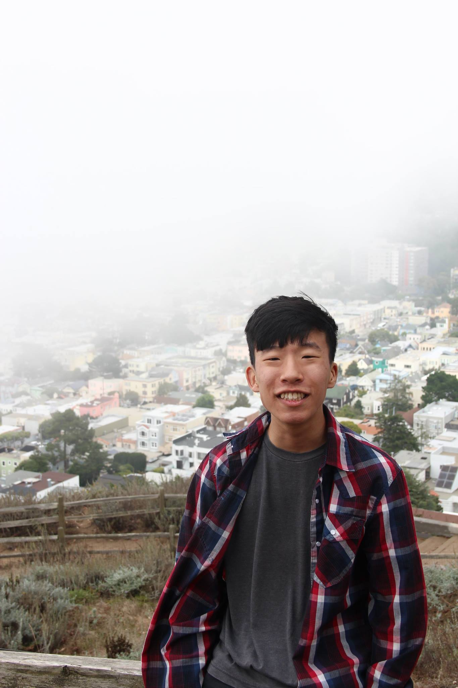

{: .image-left width="315px"}

Hello! I am a recent graduate of Brown University, where I studied Applied Math and Computer Science. I am broadly interested in theoretical and applied cryptography. 

During my time at Brown, I was fortunate to work with <a href="http://cs.brown.edu/~seny/">Seny Kamara</a> on multiple projects dealing with leakage attacks, searchable databases, and MPC, as well as <a href="http://cs.brown.edu/people/eupfal/">Eli Upfal</a> on weakly supervised learning.

     
<!-- [[Google Scholar]](https://scholar.google.com/citations?user=JPKTNnMAAAAJ&hl=en&oi=ao)>
[[CV]](chitra_cv_spring_2020.pdf) -->

<!-- Here is [my CV](chitra_cv_spring_2020.pdf) and [Google Scholar](https://scholar.google.com/citations?user=JPKTNnMAAAAJ&hl=en&oi=ao). -->

&nbsp;
## News
- 03/2021: I will be attending CMU starting Fall 2021 where I will be studying cryptography and systems security. 
- 01/2021: See the following [Wired](https://www.wired.com/story/national-gun-registry-encrypted-decentralized) article about our recent work to appear at Oakland 2021.
-  01/2021: Our paper "Semi-Supervised Aggregation of Dependent Weak Supervision Sources with Performance Guarantees" has been accepted to AISTATS 2021!